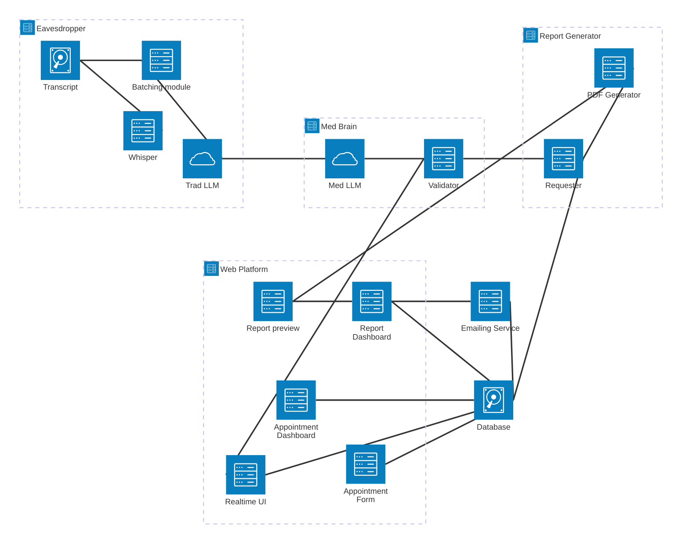
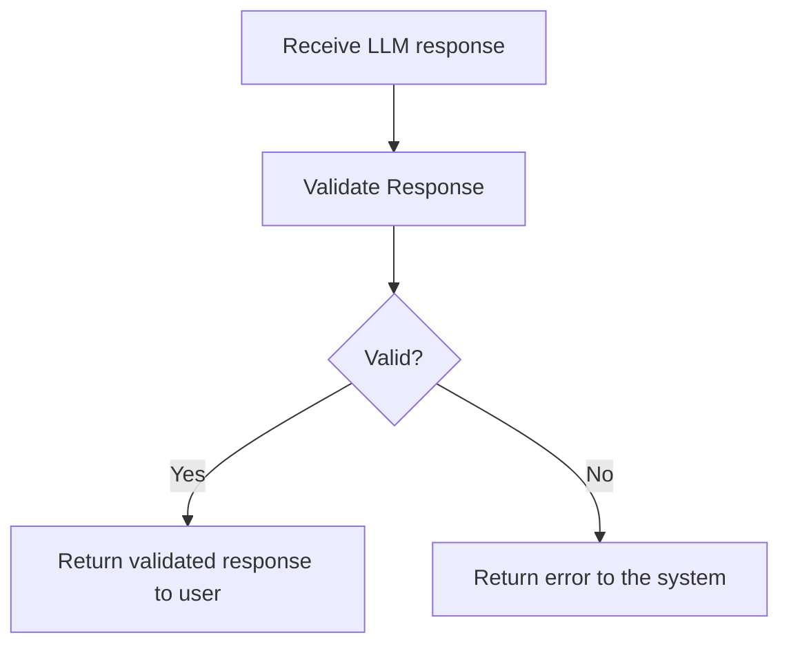
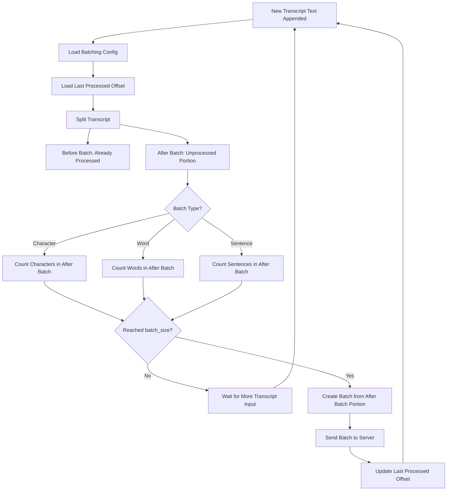
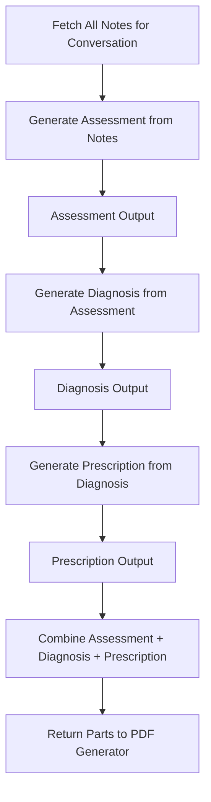
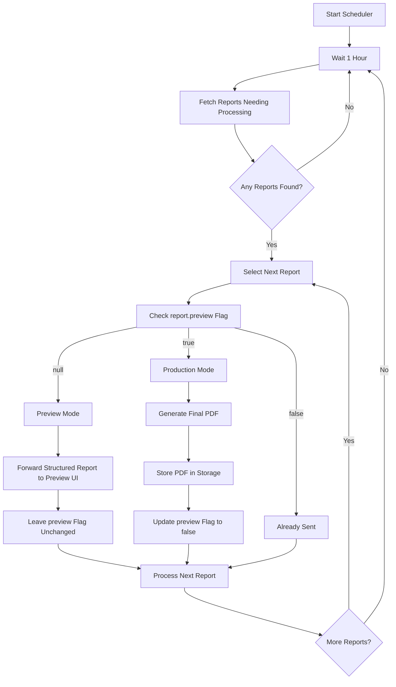
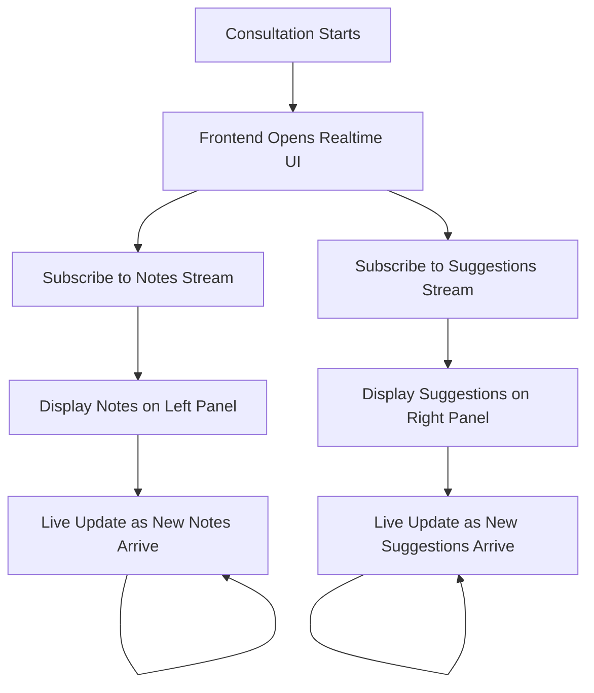
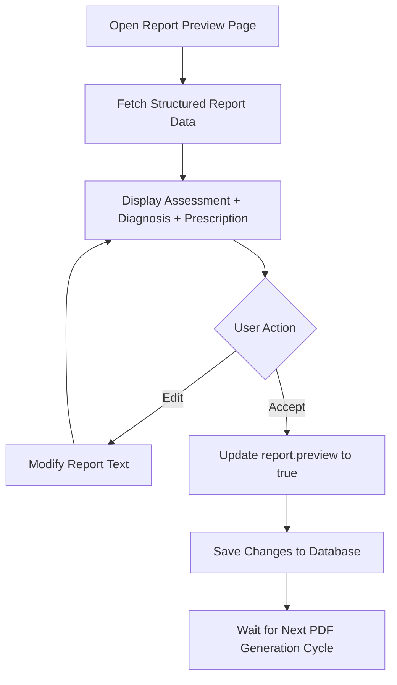
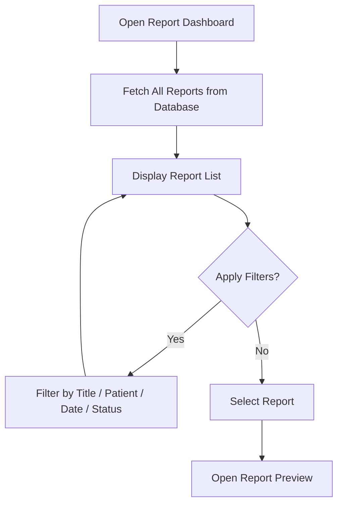
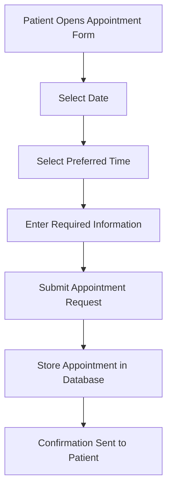
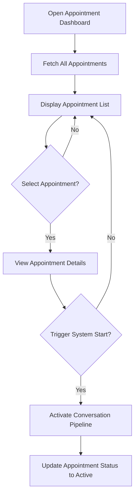

# High Level Overview of system and implementation
**Warning: elements here may or may not be implemented in the project based on the stage of the project**

## Where does the system exist
The syste, eavesdrops on the conversation between the medical personel and the patient
```txt
                +------------------+
                |      SYSTEM      |
                +------------------+
                          |
                          v
                    +-----------+
                    |  WHISPER  |
                    +-----------+
                      ^       ^
                     /         \
                    /           \
        +-----------+           +-----------+
        |   PERSON 1| <-------> |  PERSON 2 |
        +-----------+           +-----------+
```

## High Level Overview - of the whole system


# 2. System Modules

## 2.1 Med Brain - Medically oriented support

- **Purpose:** Uses a Medically oriented LLM to send advice to the other modules.
- **Repo location:** [`../medBrain`](../medBrain)
- **Notes:** At the current state of the project this module does not have auth, and is not protected against unwanted LLM calls

### 2.1.1 Sub-Components

- **Validator:** Uses a Medically oriented LLM to send advice to the other modules.
- **LLM Gate:** Instead of calling the Ollama endpoint this module will do the calling and validation of the request.

#### 2.1.1.1 Validator

Checks if response from an LLM fits a proper format or has correct data.

E.g blocks keywords like **as your AI asistant** or improper tag; something other than **Suggestion** or **Note**; since Med Brain handles also final report generation this will also validate the report secitons.



#### 2.1.1.2 LLM Gate

In between the Ollama endpoint and the rest of the system. Validates request from the other parts of the system.

Responsible for calling Ollama endpoint. Also holds the system prompt for the service.

```
flowchart TD
    A[Request] --> B[optional - Check Auth]
    B --> C[Check Request ]
    C --> D[Forward request to Validator with correct options]
    D --> E[Receive a validated response]
    E --> F[Return response to LLM Gate]
```

## 2.2 Eavesdropper - listens to the sympthoms

- **Purpose:** Transcribes the conversation and forms optimised questions to Med Brain
- **Repo location:** [`../eavesdropper`](../eavesdropper)
- **Notes:** This module lives close to the user (at least part of it) and tries to pick up as much information as possible form the conversation. For best results Whisper subcomponnent should hava an input microphone close to the user.

### 2.2.1 Sub-Components

**LOCAL**
- **Whisper:** Listens to the conversation and appends the Transript.
- **Transcript:** Whole conversation that constantly gets appended - most likely just a text file - will live on users device
- **Batching module:** Batches the conversation based on configs - by number of words or sentences.

**SERVER**
- **Trad LLM Gate:** Instead of calling the Ollama endpoint this module will do the calling and validation of the request. forms a question and forwards it to the Med Brain

```
flowchart TD
    A[User Conversation] --> B[Whisper: Listen & Transcribe]
    B --> C[Append to Transcript]
    C --> D[Batching Module]
    D --> E[Create batch based on config: words/sentences]
    E --> F[Send batch to Trad LLM Gate]
```

#### 2.2.1.1 Whisper

Uses Whisper from Open AI to transcribe speach into text. [`https://github.com/openai/whisper`](official Whisper Repo)

#### 2.2.1.2 Transcript 

For now nothing more then just being a file

#### 2.2.1.3 Batching module: 

The system needs a short-term memory to store the last sent batch. It should split the transcript into two parts: `before batch` and `after batch`. Only the `after batch` is processed and counted, so it never sends the same data twice.



#### 2.2.1.4 Trad LLM Gate

In between the Ollama endpoint and the rest of the system. Validates request from the other parts of the system.

Responsible for calling Ollama endpoint. Also holds the system prompt for the service.

```
flowchart TD
    A[Request] --> B[optional - Check Auth]
    B --> C[Check Request ]
    C --> D[Uses Ollama for question generation]
    D --> E[Forwards the generated question to Med Brain]
```

## 2.3 Report Generator - Generates the Report

- **Purpose:** Generates Report and prompts Med Brain for report sections
- **Repo location:** [`../reportGenerator`](../reportGenerator)
- **Notes:** Remember that flow is Requester > genrator (prev) > preview mode > generator (prod) > forward to the system

### 2.3.1 Sub-Components

- **Requester:** Handles the actuall part by part prompting of Med Brain to ensure correct flow. passes the Notes to the system and
- **PDF generator:** Has two modes preview without generating an actuall pdf just forwards the information to Report preview; and production generating the actuall report based on the edited/accepted preview report.

#### 2.3.1.1 Requester

Gets all notes for this specific conversation that report has to be generated for and then generates an assessment --> then based on assesment geerates a Diagnosis --> then based on diagnosis the prescription. after this cycle has been completed returns all 3 parts to the PDF generator



#### 2.3.1.2 PDF generator

| `report.preview` value | Meaning         | Action                                    |
| ---------------------- | --------------- | ----------------------------------------- |
| `null`                 | ready for Preview mode    | Send to Report Preview (no PDF generated) |
| `true`                 | ready for Production mode | Generate actual PDF                       |
| `false`                | Already sent    | Do nothing                                |



## 2.4 Emailing Service - Sends the emails with to the patients with the reports
**To decide on the meeting**

## 2.5 Web Platform - User access points and more

- **Purpose:** Handles UI and Backend the system. bulk of UI and UX
- **Repo location:** [`../webPlatform`](../webPlatform)
- **Notes:** Access point to the system handles the database connections and bulk of what user sees

### 2.5.1 Sub-Components

- **Realtime UI:** Displays Notes and Suggestions to the doctor/nurse to support the conversation

- **Report Preview:** Allows the personel to review the `singular` report based on what was genereted and forwards that information to the PDF Generator
- **Report Dashboard:** Dashboard allowing for seeing ALL of the report generated and those not generated - do not store PDFS sections are enough and we can always just build a pdf again if we have the text

- **Appointment Form:** Online Form for the end user allowing them to schedule the visit.
- **Appointment Dashboard:** Dashboard allowing the personel to trigger the system when appointment gets started as well as see where and when appointemnts take place with which doctors/nurses.


#### 2.5.1.2 Realtime UI

Streams notes and suggestions to the user. E.g left side reserved for notes right for suggestions
This way user knows what to ask the patient and where to lead the conversation to use the time as efficiently as possible.



#### 2.5.1.2 Report Preview

Screen used for Preview of the singluar report. Not a PDF editor just a Text editor. Allows the personel to make changes or just accept the genereted report. Swithces the flag in the database to `true` to finalize the report in the next cycle.



#### 2.5.1.3 Report Dashboard

Allows the personel to see all Reports and filter the by title patient or generation date. or status.



#### 2.5.1.3 Appointment Form

Allows the patient to book an appoitmnet with a date picking functionality and prefered time.



#### 2.5.1.4 Appointment Dashboard

Allows the personel to see all apoitments and tirgger the start of the system for a selected one.



## 2.6 Database - Holds the data of the system
**Plan out the desing**

# 3. Possible Considerations

Should the nurse have access to the Report Preview screen? or do they not have the qualifications?
Should the system allow the personel to move the appointments in this project? and if so who can do it? and how do we notify the patient about the change or ask them for confirmation? - Maybe asking the patient to pick multiple dates and then rescheduling them to the next one is the way to go.


